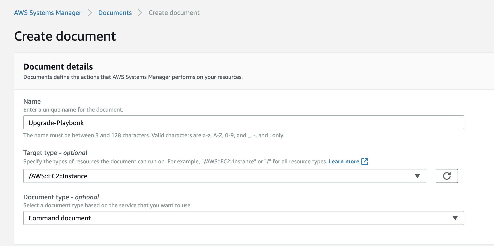
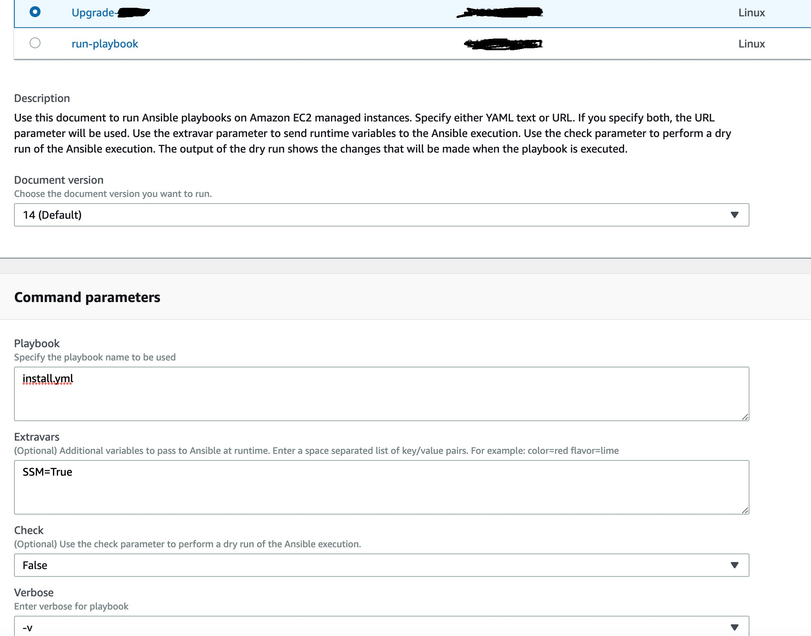
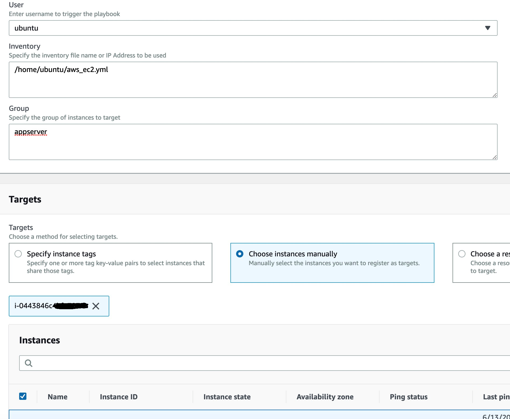
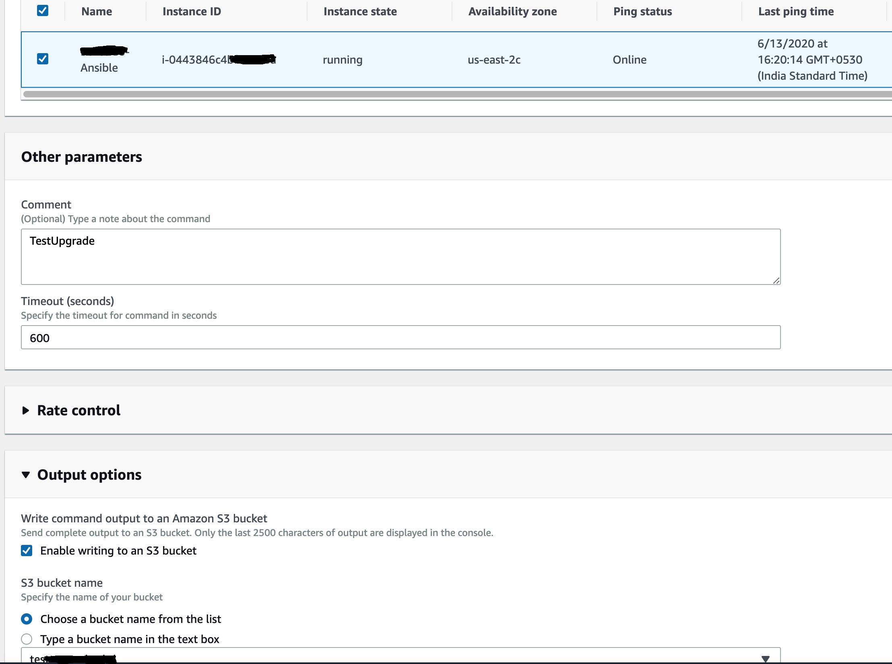

# Automatic Deployment using Ansible Dynamic Inventory and AWS System Manager

Using AWS system manager run command and AWS Dynamic Inventory you can easily automate the deployments or any other tasks that you want to run on your infrastructure. In this example, let's see how we can automate the deployment using AWS systen manager run commands. I assume you have the dynamic inventory set up ready, if not please see refer this link to set up the dynamic inventory.

### Make sure you have SSM agent running

Most of the new linux boxes aws by default install ssm agent and enable it. To install manually refer the [aws document](https://docs.aws.amazon.com/systems-manager/latest/userguide/sysman-manual-agent-install.html).

```
ubuntu@ip-172-31-38-43:~$ sudo snap services amazon-ssm-agent
Service                            Startup  Current  Notes
amazon-ssm-agent.amazon-ssm-agent  enabled  active   -
```

### Create a custom run command document for your deployment

It's upto the use case to have a seperate document created for your deployment or you can use pre-existing document AWS-RunAnsiblePlaybook to trigger your deployment playbook. Here I will be slightly modifying the existing AWS-RunAnsiblePlaybook document to include my changes and name it as Upgrade-Playbook. If you have multiple accounts, you can share this document with multiple AWS Account or Public to make use of the same document everywhere. And the documents are region specific.

Go to AWS System Manager -> Documents -> Create command or session



In the content section, I will be using the below modified content.

```
{
  "schemaVersion": "2.0",
  "description": "This is a custom document. Use this document to run Ansible playbooks to upgrade my components.",
  "parameters": {
    "playbook": {
      "type": "String",
      "description": "Specify the playbook name to be used",
      "default": "",
      "displayType": "textarea"
    },
    "extravars": {
      "type": "String",
      "description": "(Optional) Additional variables to pass to Ansible at runtime. Enter a space separated list of key/value pairs. For example: color=red flavor=lime",
      "default": "SSM=True",
      "displayType": "textarea",
      "allowedPattern": "^$|^\\w+\\=\\S+(\\s\\w+\\=\\S+)*$"
    },
    "check": {
      "type": "String",
      "description": " (Optional) Use the check parameter to perform a dry run of the Ansible execution.",
      "allowedValues": [
        "True",
        "False"
      ],
      "default": "False"
    },
    "verbose": {
      "type": "String",
      "description": " Enter verbose for playbook",
      "allowedValues": [
        "-v",
        "-vv",
        "-vvv"
      ],
      "default": "-v"
    },
    "user": {
      "type": "String",
      "description": " Enter username to trigger the playbook",
      "allowedValues": [
        "ubuntu",
        "root"
      ],
      "default": "ubuntu"
    },
    "inventory": {
      "type": "String",
      "description": "Specify the inventory file name or IP Address to be used",
      "default": "/home/ubuntu/aws_ec2.yml",
      "displayType": "textarea"
    },
    "group": {
      "type": "String",
      "description": "Specify the group of instances to target",
      "default": "",
      "displayType": "textarea"
    }
  },
  "mainSteps": [
    {
      "action": "aws:runShellScript",
      "name": "runShellScript",
      "inputs": {
        "runCommand": [
          "#!/bin/bash",
          "playbook_path=/home/ubuntu/Ansible_Playbook/",
          "export ANSIBLE_HOST_KEY_CHECKING=False",
          "echo \"Activating Python Virtual Environment.\"",
          ". /home/ubuntu/ansible2.7/bin/activate",
          "echo \"Changing to working directory : $playbook_path\"",
          "cd $playbook_path",
          "echo \"Launching playbook : $playbook\"",
          "ansible --version",
          "if [ $? -ne 0 ]; then",
          " echo \"Ansible is not installed. Please install Ansible and rerun the command\" >&2",
          " exit 1",
          "fi",
          "execdir=$(dirname $0)",
          "cd $execdir",
          "cd $playbook_path",
          "if [ -z '{{playbook}}' ] ; then",
          " echo \"Playbook name can't be empty\" >&2",
          " exit 1",
          "else",
          " echo \"Launching playbook : '{{playbook}}'\"",
          "fi",
          "if  [[ \"{{check}}\" == True ]] ; then",
          "   sudo -u \"{{user}}\" ansible-playbook -i \"{{inventory}}\" -l \"{{group}}\" --check -c \"{{extravars}}\" \"{{verbose}}\" \"{{playbook}}\"",
          "else",
          "   sudo -u \"{{user}}\" ansible-playbook -i \"{{inventory}}\" -l \"{{group}}\" -e \"{{extravars}}\" \"{{verbose}}\" \"{{playbook}}\"",
          "fi"
        ]
      }
    }
  ]
}
```

I will be running this on my Ansible machine. The dynamic inventory file should be placed on the ansible machine at this path(/home/ubuntu/aws_ec2.yml) and the respective playbook should be available in this path(/home/ubuntu/Ansible_Playbook/).





That's it! Now when you trigger the upgrade playbook with correct parameters, your group of hosts will be upgraded easily.
