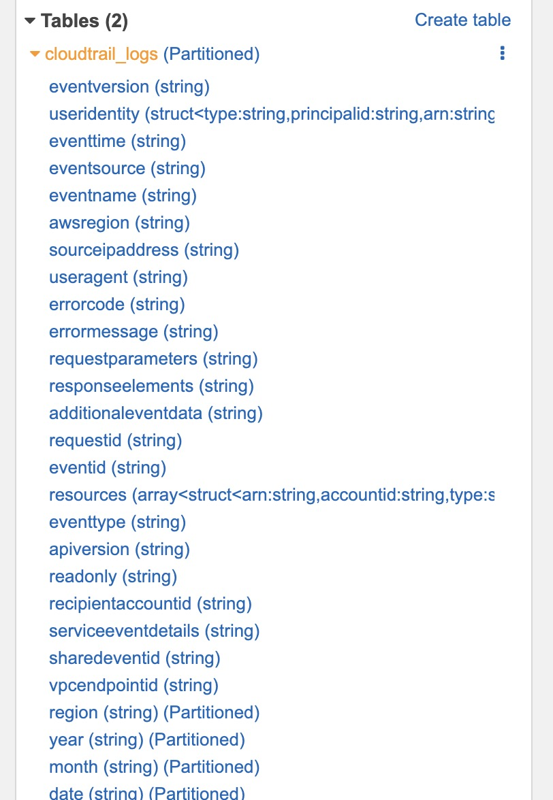
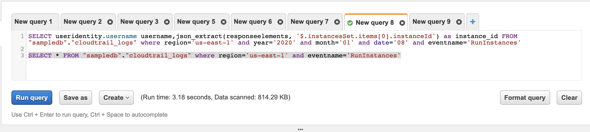
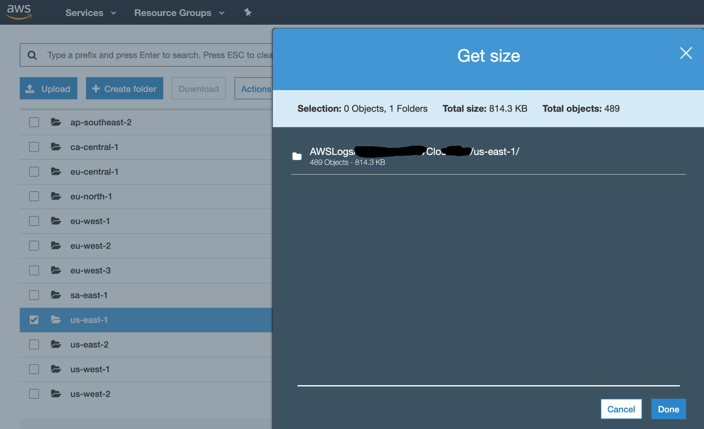
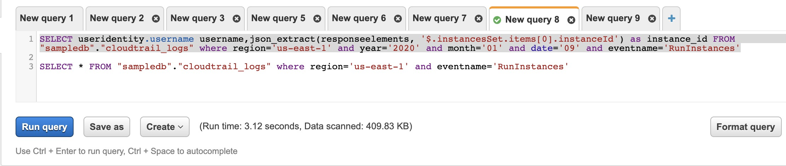
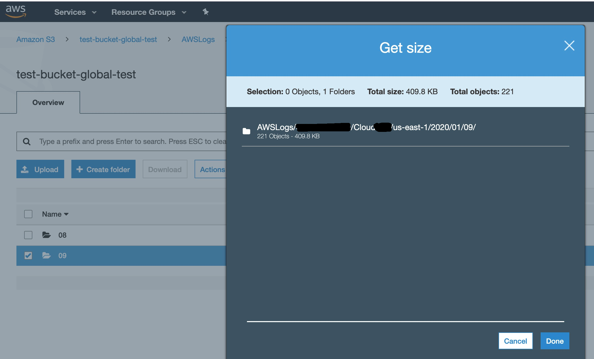

# How to create partitions in Athena

Athena is service offered by AWS which is used to query csv/tsv/json files directly by coverting it into tables. When you have huge data to scan such as daily logs/metrics it is good to spilt the data into partitions and load it into athena. When you load data as partitions you have benefits to query only a selected partitions which will help you to save huge cost (since athena is billed for total data scanned) and obvisouly it will increase the query performance as well as we are query only less data in partitions compared to whole bunch of data.

This is the sample table which I created for reading cloudtrail logs from S3 to Athena. The path of S3 folder is 
bucket_name/AWSLogs/accountid/CloudTrail/region/year/month/date/filename.gz files. CloudTrail will upload .gz files in the mentioned folder structure. So when you need to find the who is the user that has launched instances in us-east-1 region within last 1 week, it is unnecessary to scan the whole data. If you have partitions on region, year, month, date you can just scan only the related data and produce the same result in a cost effective and performance effective way.

### Below sample query will create the Athena table with region, year, month and date partitions.

```
CREATE EXTERNAL TABLE `cloudtrail_logs`(
  `eventversion` string COMMENT 'from deserializer', 
  `useridentity` struct<type:string,principalid:string,arn:string,accountid:string,invokedby:string,accesskeyid:string,username:string,sessioncontext:struct<attributes:struct<mfaauthenticated:string,creationdate:string>,sessionissuer:struct<type:string,principalid:string,arn:string,accountid:string,username:string>>> COMMENT 'from deserializer', 
  `eventtime` string COMMENT 'from deserializer', 
  `eventsource` string COMMENT 'from deserializer', 
  `eventname` string COMMENT 'from deserializer', 
  `awsregion` string COMMENT 'from deserializer', 
  `sourceipaddress` string COMMENT 'from deserializer', 
  `useragent` string COMMENT 'from deserializer', 
  `errorcode` string COMMENT 'from deserializer', 
  `errormessage` string COMMENT 'from deserializer', 
  `requestparameters` string COMMENT 'from deserializer', 
  `responseelements` string COMMENT 'from deserializer', 
  `additionaleventdata` string COMMENT 'from deserializer', 
  `requestid` string COMMENT 'from deserializer', 
  `eventid` string COMMENT 'from deserializer', 
  `resources` array<struct<arn:string,accountid:string,type:string>> COMMENT 'from deserializer', 
  `eventtype` string COMMENT 'from deserializer', 
  `apiversion` string COMMENT 'from deserializer', 
  `readonly` string COMMENT 'from deserializer', 
  `recipientaccountid` string COMMENT 'from deserializer', 
  `serviceeventdetails` string COMMENT 'from deserializer', 
  `sharedeventid` string COMMENT 'from deserializer', 
  `vpcendpointid` string COMMENT 'from deserializer')
PARTITIONED BY ( 
  `region` string, 
  `year` string, 
  `month` string, 
  `date` string)
ROW FORMAT SERDE 
  'com.amazon.emr.hive.serde.CloudTrailSerde' 
STORED AS INPUTFORMAT 
  'com.amazon.emr.cloudtrail.CloudTrailInputFormat' 
OUTPUTFORMAT 
  'org.apache.hadoop.hive.ql.io.HiveIgnoreKeyTextOutputFormat'
LOCATION
  's3://your_cloudtrail_bucket_name/AWSLogs/Account_ID'
```

Running the above query will create you the partitioned table named cloudtrail_logs. By default there won't be any data in the table, you have to load each partitions individually so that it will load the S3 files to athena table.

### Below is the command to load the partitions to the table.

```
ALTER TABLE sampledb.cloudtrail_logs ADD PARTITION (region = 'us-east-1', year = '2020', month = '01', date = '08') LOCATION 's3://your_cloudtrail_bucket_name/AWSLogs/Account_ID/CloudTrail/us-east-1/2020/01/08/';
```

It is really difficult to load the data manually for all the regions daily. I already have a lambda function created in my 'python_boto3' repository which has python file which will load the partitions automatically whenever you trigger the function.

### How to fetch the data using partitions?

Using where condition you can fetch the data from partitions. 
Once your table is created with partitions you will see all the partitions as an extra column in your tables. When you look at the below table, we never provided any column named region/year/month/date in the above create table statement but we got these 4 new columns. It is created based on our partitions.



### Let's see the actual benefits by running different queries

Running query with just region partition, below query just uses one where condition. i.e. region



Data scanned is 814.29 KB.

S3 size is 814.3 KB of folder s3://your_cloudtrail_bucket_name/AWSLogs/Account_ID/CloudTrail/us-east-1/ is also 814.3 KB.



Whereas running query with all partitions region, year, month and date. Data scanned in athena is 409.83 KB.



And the S3 size of the folder s3://your_cloudtrail_bucket_name/AWSLogs/Account_ID/CloudTrail/us-east-1/2020/01/09 is also 409.9 KB.



Which concludes that using partitions we scan lesser data and get the same result in an efficient way.

### Another method of loading data into partitioned table

This is just one way of loading partitions into the table. The above method of loading partition is used when you have th folder structure as 2019/01/03 i.e. without year=2019/month=01/date=03. There is another way of loading partition as well and that is used when your folder structure is like region=us-east-1/year=2020/month=01/date=05 etc.

You can just run the below command and it will load the all the partitions to the table at once.

```
MSCK REPAIR TABLE table_name;
```


```
import json
import boto3
import time
from datetime import datetime

s3 = boto3.client('s3')
athena = boto3.client('athena')
s3_resource = boto3.resource('s3')

table_name = 'your_table_for_cloudtrail_logs'
regions = ['us-east-1', 'us-east-2', 'us-west-1', 'us-west-2']
s3_input = 's3://s3-bucket-you-configured-for-cloudtrail-logs/AWSLogs/XXXXXXXXXXXX/CloudTrail/'
database = 'sampledb'
s3_output = 's3://your-s3-lambda-output-bucket/'
awsevent = 'RunInstances'
ec2_details = []
partition_day = datetime.now().day - 1
partition_month = datetime.now().month
partition_year = datetime.now().year
if partition_day < 10:
    partition_day = str(partition_day).zfill(2)
if partition_month < 10:
    partition_month = str(partition_month).zfill(2)


# Creating tags based on the instance details fetched
def tag_instances(executionID):
    loop = 0
    obj = s3_resource.Object('your-s3-lambda-output-bucket', executionID+".csv")
    contents=obj.get()['Body'].read().decode(encoding="utf-8",errors="ignore")
    for line in contents.splitlines():
        if loop > 0:
            user = line.split(',')[0].replace('"','')
            ec2_instance = line.split(',')[1].replace('"','')
            ec2_region = line.split(',')[2].replace('"','')
            ec2 = boto3.client('ec2', region_name = ec2_region)
            try:
                response = ec2.describe_instance_status(InstanceIds=[ec2_instance])
                print("Instance exists and creating tags", ec2_instance)
                ec2.create_tags(
                    DryRun=False,
                    Resources=[
                        ec2_instance,
                    ],
                    Tags=[
                        {
                            'Key': 'Launched By',
                            'Value': user
                        },
                    ]
                )
            except Exception as e:
                print(e)
                print("Tag not creating for this instance, see above exception for details", ec2_instance)
        loop = loop + 1


#Executing the athena query to fetch instance and user details
def get_results(executionID):
    retries = 0
    status = athena.get_query_execution(
    QueryExecutionId=executionID
    )
    print(status['QueryExecution']['Status']['State'])
    results = athena.get_query_results(
    QueryExecutionId=executionID
    )
    tag_instances(executionID)


# Fetch the launched instance details from athena table
def get_instance_launch():
    for region in regions:
        instance_query = str("SELECT useridentity.username username,json_extract(responseelements, '$.instancesSet.items[0].instanceId') instanceid, region FROM "+ table_name +" WHERE region='"
        + region + "' and year='"
        + str(partition_year) + "' and month='" 
        + str(partition_month) + "' and date='"
        + str(partition_day) + "' and eventname='"
        + awsevent + "';")
        query_response = athena.start_query_execution(
        QueryString=instance_query,
        QueryExecutionContext={
            'Database': database
            },
        ResultConfiguration={
            'OutputLocation': s3_output,
            }
        )
        time.sleep(12)
        get_results(query_response['QueryExecutionId'])
    

# Query to load the S3 partitions in athena
def lambda_handler(event, context):
    for region in regions:
        query = str("ALTER TABLE "+ table_name +" ADD PARTITION (region='"
        + region + "',year="
        + str(partition_year) + ",month=" 
        + str(partition_month) + ",date="
        + str(partition_day)
        + ") location '"+s3_input
        + region
        + "/" + str(partition_year)
        + "/" + (partition_month) + "/"
        + str(partition_day) + "';")
        query_response = athena.start_query_execution(
        QueryString=query,
        QueryExecutionContext={
            'Database': database
            },
        ResultConfiguration={
            'OutputLocation': s3_output,
            }
        )
    get_instance_launch()
```
