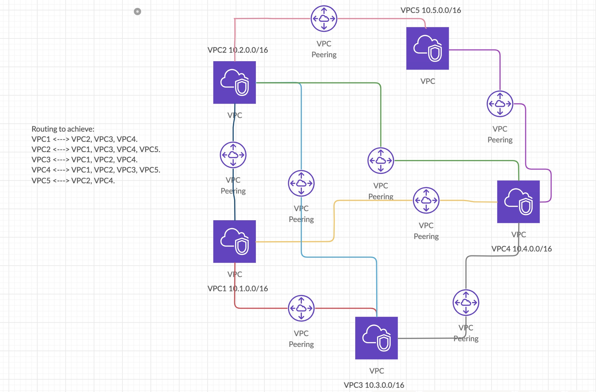
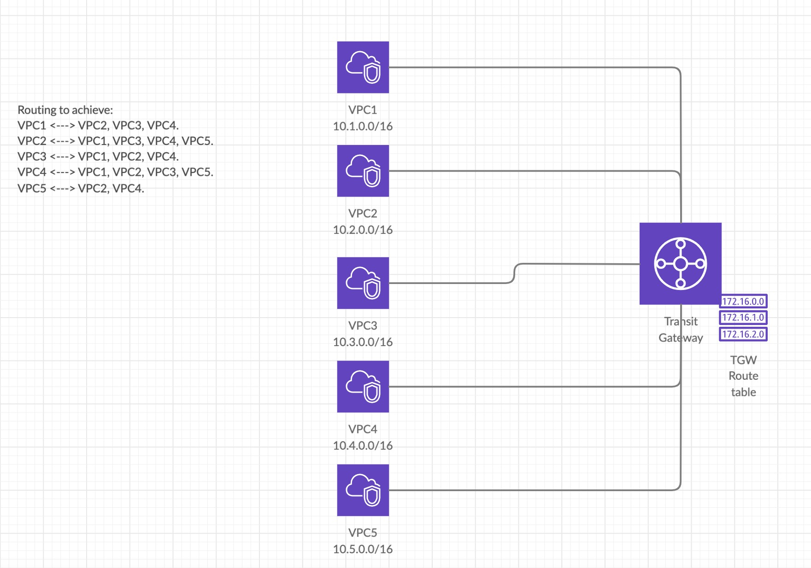
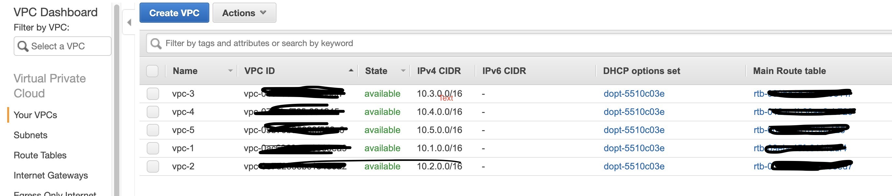
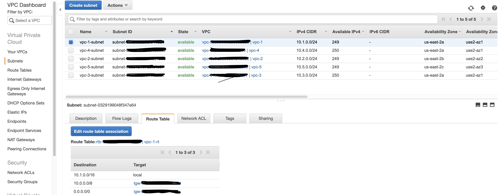
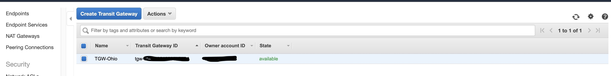
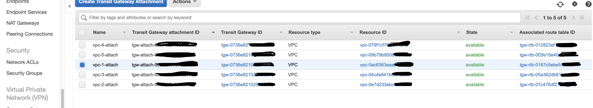
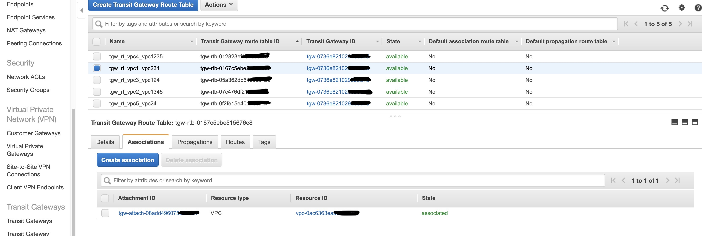
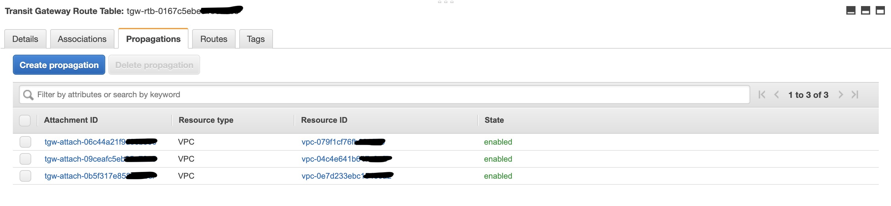
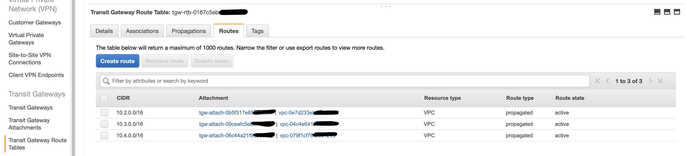

# AWS - Transit Gateway (TGW)

Transit Gateway is a service provided by AWS inorder to connect multiple VPC/on-premise server to a single gateway. As of now transit gateway is a region specific service.

Points specific to TGW:

1) Attachments:
     Connection between a VPC/VPN and a Transit gateway (TGW).

2) Association:
     Association is used to identify which route table to be called when a traffic comes for a particular VPC CIDR.

3) Propogation:
     Propogation is used to propogate the routes in route table.

4) Route Tables:
     Consists of routes (where to look for the next hop).
     
The example scenario here I took has 5 VPC. For simplicity I have named the vpc, subnets and other related components in a easier way. You may need to name then appropriately when you create the infra for prod set up.

VPC1 10.1.0.0/16
VPC2 10.2.0.0/16
VPC3 10.3.0.0/16
VPC4 10.4.0.0/16
VPC5 10.5.0.0/16

Scenario planning to achieve: 
NOTE: <---> both can talk to each other.

1) VPC1 <---> VPC2, VPC3, VPC4.
2) VPC2 <---> VPC1, VPC3, VPC4, VPC5.
3) VPC3 <---> VPC1, VPC2, VPC4.
4) VPC4 <---> VPC1, VPC2, VPC3, VPC5.
5) VPC5 <---> VPC2, VPC4.

For a full mesh configuration, you will end up creating n(n-1)/2 where n is the number of VPC. 

Let us take the number of VPC as 5, for a full mesh you need to create 5(5-1)/2 = 10 VPC peering connections. When you have 10 VPC, you need to create 45 peering connections. It will drastically increase when the number of VPC increases.

Below is a sample architecture of 5 VPC, where we created 8 peering connections in order to achieve our routing expectations. (Note: our requirement is not a full mesh configuration).

# VPC Peering Architecture 

Above VPC Peering has difficult to manage since we need to modify the route table for each VPC and it is complex when VPC increases more than 5 or 10. Below is the architecture of same model in VPC Transit gateway. All the routing is carried out inside TGW route tables.

# TGW Architecture

VPC Structure

VPC Routing Table

Transit Gateway

Transit Gateway Attachment

Transit Route Table

Transit Route Propagations

Transit Routes

Let's see how the overall flow works.
Example: Instance in VPC1 is trying to access instance in VPC2.
10.1.0.1 trying to access 10.2.0.1

Route table attached to the subnet in VPC has a route entry for 10.0.0.0/8 which has the closest match for 10.2.0.1. Hence the traffic goes to our transit gateway. Look at routetable image (entry 2).

TGW recieves the traffic from VPC1. It now checks which association is availalbe for the VPC1, from that it will see which propagation has configured. And which route table is configured and route traffic accordingly.

The traffic for 10.2.0.1 is coming from VPC1 to VPC2. tgw_rt_vpc1_vpc234 is associated to VPC1 (i.e. VPC1 attachment), and the traffic destination 10.2.0.1 has a matching route table entry in tgw route table. Hence it will forward that request to VPC2 attachment (i.e. the VPC2 itself).

Ideally we must have a routing option from VPC2 to VPC1, so that the outbound traffic will come to VPC1.
